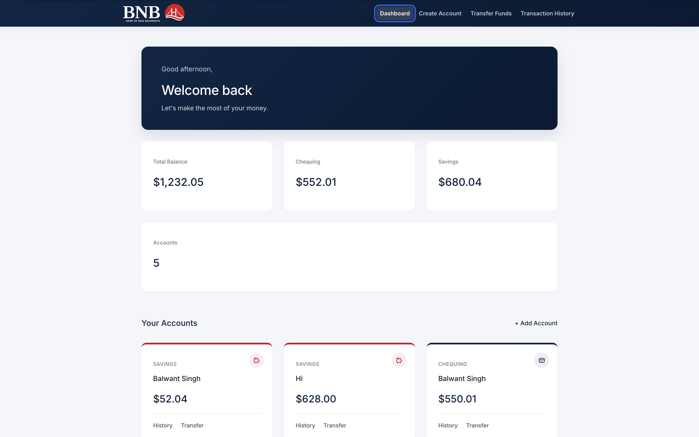
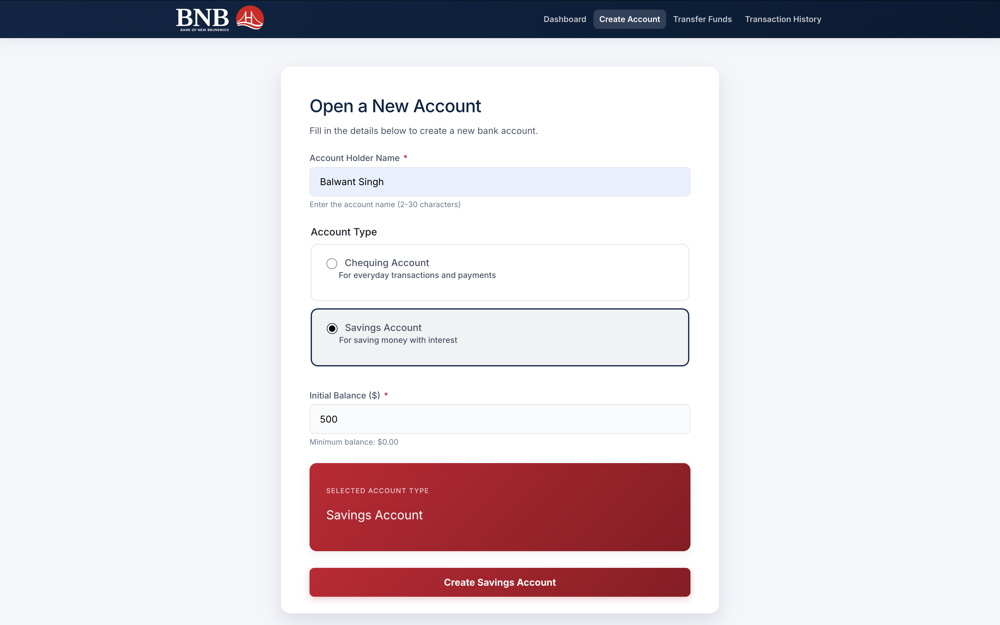
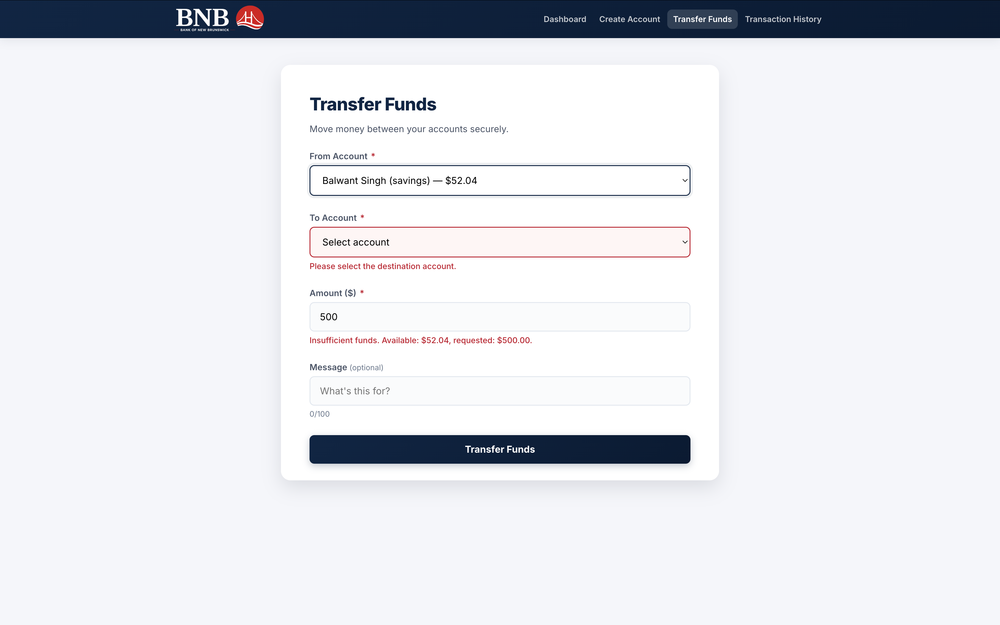
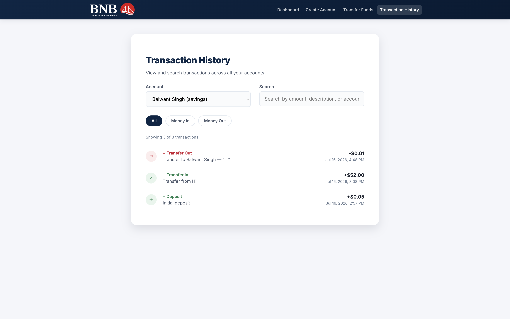
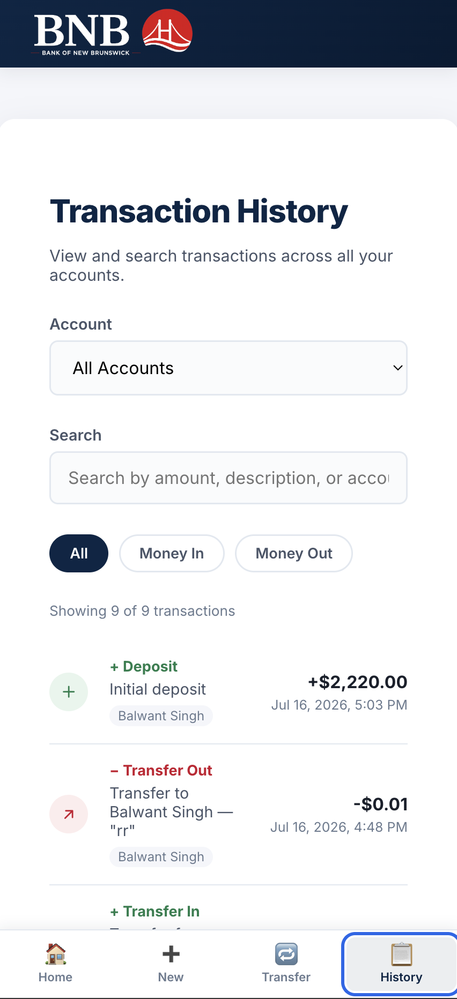

# BNB — Bank of New Brunswick

A banking web app built with Angular. Create accounts, transfer funds, and view transaction history — all data persisted locally via `localStorage`, no backend required.

## Table of Contents
- [Screenshots](#screenshots)
- [Features](#features)
- [Tech Stack](#tech-stack)
- [Getting Started](#getting-started)
- [Project Structure](#project-structure)
- [Notable Decisions](#notable-decisions)
- [Accessibility](#accessibility)
- [Known Limitations](#known-limitations)

## Screenshots

### Dashboard


### Create Account


### Transfer Funds


### Transaction History


### Mobile View


## Features

- **Create Account** — Chequing or Savings, FormBuilder validation, conditional button styling
- **Transfer Funds** — custom validators (insufficient balance, same-account), optional message, receipt summary
- **Transaction History** — search by amount/description, filter by type, pagination
- **Dashboard** — total/chequing/savings balances, recent activity, account overflow handling
- **Persistence** — accounts and transactions saved to `localStorage`
- **Responsive** — bottom tab bar navigation on mobile
- **Accessible** — skip link, ARIA attributes, keyboard navigable, WCAG AA contrast

## Tech Stack

| Technology | Purpose |
|---|---|
| Angular 19 (NgModules) | Framework |
| Angular Material | Base theming |
| Angular Signals | State management |
| Reactive Forms | Forms + custom validators |
| SCSS | Styling |

## Getting Started

```bash
npm install -g @angular/cli
git clone <repo-url>
cd bnb-banking
npm install
ng serve
```

Open `http://localhost:4200`.

## Project Structure

```
src/app
├── core
│   ├── models        # Account, Transaction
│   └── services       # AccountService (signals), StorageService
├── shared
│   ├── components      # custom button, loading modal
│   ├── pipes            # transactionType
│   └── validators       # sameAccountValidator, sufficientBalanceValidator
└── features
    ├── dashboard
    ├── accounts/create-account
    └── transactions/transfer-funds, transaction-history
```

Each feature module is lazy-loaded via `loadChildren`.

## Notable Decisions

- **Signals over RxJS** — `AccountService` uses `signal()`/`computed()`/`effect()`, Angular's current recommended approach for local state; less boilerplate than manual subscriptions, and `computed()` keeps derived values (like totals) always in sync.
- **Two focused custom validators** rather than one combined — `sameAccountValidator` and `sufficientBalanceValidator` each handle one rule, composed via Angular's `validators: [...]` array.
- **StorageService + `effect()`** — any signal change auto-persists to `localStorage`; no manual save calls scattered through the app.

## Accessibility

- Skip-to-content link
- `aria-current="page"` on active nav link
- `fieldset`/`legend`, `aria-invalid`, `role="alert"` on forms
- Visible focus rings, WCAG AA contrast